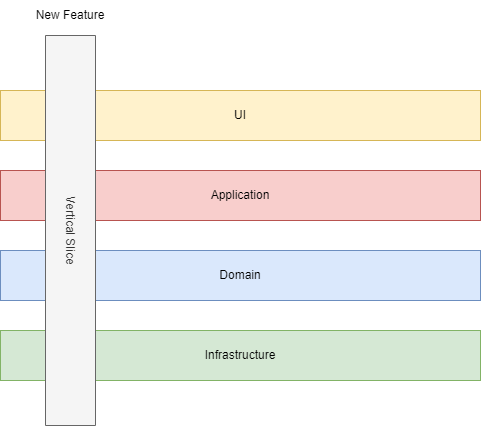

# Vertical-Slice-Architecture

[](https://github.com/Amitpnk/Vertical-Slice-Architecture/actions/workflows/dotnet.yml)
[](https://github.com/Amitpnk/Vertical-Slice-Architecture/blob/main/LICENSE)

A clean, modular **.NET 9** template using **Vertical Slice Architecture** — ideal for building scalable, maintainable APIs with **CQRS**, **Mediator Design Pattern**, **FluentValidation**, and **EF Core/Dapper**.

## Give a Star! :star:
If you like or are using this project to learn or start your solution, please give it a star. Thanks!

## Support This Project

If you have found this project helpful, either as a library that you use or as a learning tool, please consider buying me a coffee:

<a href="https://www.buymeacoffee.com/codewithamit" target="_blank"></a>

## What is Vertical Slice Architecture?

Vertical Slice Architecture organizes code by features rather than technical layers. Each “slice” encapsulates all aspects of a specific feature, including the UI, business logic, and data access. This contrasts with traditional architectures that segregate applications into horizontal layers like Controllers, Services, and Repositories.



Figure: Representation of Vertical Slice Architecture emphasizing feature-centric organization.
The image above illustrates the concept of Vertical Slice Architecture, where each feature, represented as a vertical slice, integrates all necessary components across the UI, Application, Domain, and Infrastructure layers. This ensures each feature is self-contained and simplifies scaling, testing, and maintaining code

## ✅ Features

* Vertical slice structure organized per use case (CQRS style)
* Minimal API with [Carter](https://github.com/CarterCommunity/Carter) for clean endpoint definitions
* Mediator Design Pattern for command/query dispatching (withou MediatR library)
* FluentValidation for request validation
* EF Core-based persistence layer (with optional Dapper support)
* Docker and Docker Compose support
* Testable, modular, and decoupled architecture

## 🚀 Getting Started

### 1. Clone the Repository

```bash
git clone https://github.com/Amitpnk/Vertical-Slice-Architecture.git
cd Vertical-Slice-Architecture
```

### 2. Build and Run with Docker

To build and start the containers:

```bash
docker-compose up --build
```

To run the containers in detached mode:

```bash
docker-compose up -d
```

> **Note:**
> Building the Docker image manually is not usually required, but if needed, use:
>
> ```bash
> docker build -f src/LeafByte.Parking.API/Dockerfile -t va-api .
> ```

### 3. Rebuild and Restart Containers

If you need to rebuild and restart the containers (for example, after making changes):

```bash
docker-compose down -v
docker-compose up --build
```

### 4. Open the Application

Once the containers are running, open your browser and navigate to:

```
http://localhost:5000
```

You should see the API running. Adjust the port if you have changed it in the Docker configuration.


## 📁 Project Structure

```
Vertical-Slice-Architecture/
.github/
    └── workflows/
        └── dotnet.yml
docs/
    ├── gchr.md
    └── README.md
src/
    ├── docker/
        ├── .dockerignore
        ├── docker-compose.dcproj
        ├── docker-compose.override.yml
        ├── docker-compose.yml
        └── launchSettings.json
    ├── LeafByte.Parking.API/
        ├── Customers/
            ├── CreateCustomer/
                ├── CreateCustomer.cs
                ├── CreateCustomerCommandHandler.cs
                ├── CreateCustomerCommandValidator.cs
                └── CreateCustomerEndpoint.cs
            ├── DeleteCustomer/
                ├── DeleteCustomer.cs
                ├── DeleteCustomerCommandValidator.cs
                ├── DeleteCustomerEndpoint.cs
                └── DeleteCustomerHandler.cs
            ├── GetCustomerById/
                ├── GetCustomer.cs
                ├── GetCustomerByIdEndpoint.cs
                └── GetCustomerByIdQueryHandler.cs
            ├── GetCustomers/
                ├── GetCustomer.cs
                ├── GetCustomersEndpoint.cs
                └── GetCustomersQueryHandler.cs
            └── UpdateCustomer/
                ├── UpdateCustomer.cs
                ├── UpdateCustomerCommandHandler.cs
                ├── UpdateCustomerCommandValidator.cs
                └── UpdateCustomerEndpoint.cs
        ├── Data/
            ├── CustomerContext.cs
            └── Extentions.cs
        ├── Migrations/
            └── CustomerDb/
                ├── 20250519180837_Init.cs
                ├── 20250519180837_Init.Designer.cs
                └── CustomerContextModelSnapshot.cs
        ├── Models/
            ├── Customer.cs
            ├── CustomerDto.cs
            └── CustomerExtensions.cs
        ├── Properties/
            └── launchSettings.json
        ├── appsettings.Development.json
        ├── appsettings.json
        ├── docker-compose.md
        ├── Dockerfile
        ├── Dockerfile.original
        ├── dotnet-cli.md
        ├── GlobalUsing.cs
        ├── my-sql.md
        ├── Program.cs
        ├── LeafByte.Parking.API.csproj
        └── LeafByte.Parking.API.http
    └── LeafByte.Parking.CrossCutting/
        ├── Behaviors/
            ├── LoggingBehavior.cs
            └── ValidationBehavior.cs
        ├── CQRS/
            ├── Dispatcher.cs
            ├── ICommand.cs
            ├── ICommandHandler.cs
            ├── IDispatcher.cs
            ├── IQuery.cs
            └── IQueryHandler.cs
        ├── Exceptions/
            ├── Handler/
                └── CustomExceptionHandler.cs
            ├── BadRequestException.cs
            ├── InternalServerException.cs
            └── NotFoundException.cs
        ├── Pagination/
            ├── PaginatedResult.cs
            └── PaginationRequest.cs
        └── LeafByte.Parking.CrossCutting.csproj
test/
    └── LeafByte.Parking.API.Tests/
        ├── Customers/
            └── GetCustomers/
                ├── GetCustomersQueryHandlerTests.cs
                └── GetCustomersQueryTests.cs
        ├── Data/
            └── CustomerContextTests.cs
        ├── Models/
            ├── CustomerDtoTests.cs
            ├── CustomerExtensionsTests.cs
            └── CustomerTests.cs
        └── LeafByte.Parking.API.Tests.csproj
.dockerignore
.gitignore
docker-compose.dcproj
docker-compose.override.yml
docker-compose.yml
launchSettings.json
LICENSE
LeafByte.Parking.sln
```

## 📄 License

[](https://github.com/Amitpnk/Vertical-Slice-Architecture/blob/main/LICENSE)

This project is licensed under the MIT License — see the [LICENSE](./LICENSE) file for details.

## 📬 Contact

Having issues or need help getting started? Email amit.naik8103@gmail.com or [raise a bug or feature request](https://github.com/Amitpnk/Vertical-Slice-Architecture/issues/new). Always happy to help.
